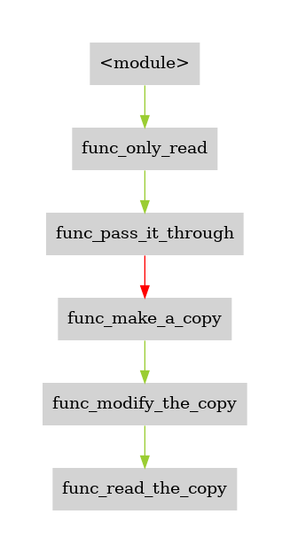
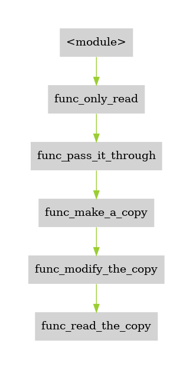
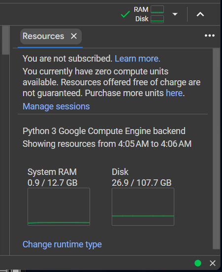
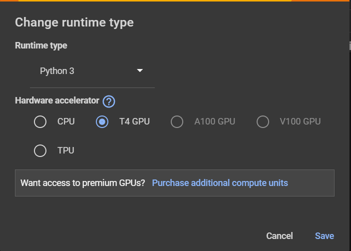
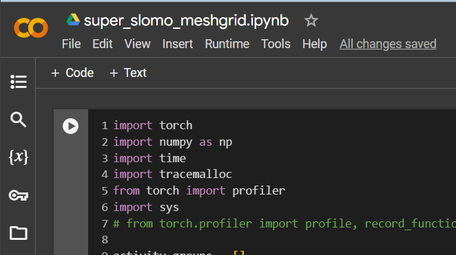

# DrPy: Pinpointing Inefficient Memory Usage in Multi-Layer
**Dy**namical profiling tools for **Py**thon applications.

This repository contains explanations for the artifact evaluations for our paper *DrPy: Pinpointing Inefficient Memory Usage in Multi-Layer*.  The **DrPy** tool generates value flow graphs to help programmers pinpoint where the redundant copy of memory objects happens. We utilize the tool **DrPy** to help find potential optimization opportunities, especially targeting the redundant copy in Python applications.

## Getting Started Guide

### Run with docker

1. Pull the docker image
```console
docker pull captaincui/drpy
```

2. Run the docker as a container
```console
docker run -t -d --name drpy-dev captaincui/drpy
```

3. Run zsh shell with the preset user `ubuntu`
```console
docker exec -it --user ubuntu drpy-dev zsh
```


### Usage

To run **DrPy**, one needs to use the following command:

1 Set the **global environment variable**
```console
export drrun=/path/to/drcctprof_clients/DrCCTProf/build/bin64/drrun
```

2 Run client tool
```console
$drrun -t drcctlib_python -- python -m valueflow <python applications>
```

e.g. The command below will start the client **drcctlib_python** and utilize the module **valueflow** to analyze python program *"example.py"*.
```console
$drrun -t drcctlib_python -- python -m valueflow 
```

### Practice

There are code snippets in the `example` folder help demonstrating how to utilize the tool.

```console
# Activate the conda environment with Numpy installed
conda activate simpletest

cd ~/workspace/example
```

The Python program `np_array.py` generates a Numpy array `random_array` and then passes it through several functions. Some functions only read the array. The function `func_make_a_copy` uses `np.array()` API to make a copy of the array `random_array`.

```Python
...
def func_make_a_copy(arr):
    print(f"Before copy, array mem address:   {id(arr)}")
    
    # np.array() defacuts to create a copy of the provied obj arr
    array_copy = np.array(arr)                              
    # array_copy = arr.copy()     # alternative way to copy

    print(f"After copy, copied array address: {id(array_copy)}")
    func_modify_the_copy(array_copy)
...
```

Run the script with the following command,
```console
python np_array.py
```

The output will be similar to this:
```console
id(random_array):                 139870089688624
id(only_read_array):              139870089688624
Before copy, array mem address:   139870089688624
After copy, copied array address: 139870348654320
Mem address of the copy:          139870348654320
```
The Python built-in function `id()` returns the memory address of Python objects in the Python interpreter.

The first three lines indicate when `random_array` is passed by reference, the memory addresses of derived Python objects stay the same. At the 4th line, the program prints out the address of the copied object. The changed address indicates the copied object does not share the same memory as the `random_array` object. The last line authenticates that objects passed by reference are as similar as alias, their memory address are the same.

However, the copy in the function `func_make_a_copy` is unnecessary, or, **redundant**, because there is no further modification on the copied object. The subsequent function can use reference as well.

##### Step 1: Detect the Copy
When we apply **DyPy** tool on this script, it can flag the redundant copy:

```console
$drrun -t drcctlib_python -- python -m valueflow np_array.py 
```
> **Note**: Please prefix `drrun` with the `$`. The `drrun` is a pre-defined environment variable. It is set at the last line in the `.zshrc` file locates in the `/home/ubuntu` directory.
```bash
export drrun=/home/ubuntu/workspace/drcctprof_clients/DrCCTProf/build/bin64/drrun
```
> The above **DrPy** tool command is the same as follows:
```console
/home/ubuntu/workspace/drcctprof_clients/DrCCTProf/build/bin64/drrun -t drcctlib_python -- python -m valueflow np_array.py 
```

The **DrPy** tool command will generate 2 image files with the same name as the application `np_array.py` suffixed with `.png` and `.svg`, respectively. The `.png` file is easy to open for a quick skim, and the `.svg` file is suitable for scaling up for more detailed information.

The figure below is part of the value flow graph for the `np_array.py` example script:



The red arrow indicates there exist redundancies when values flow through the function `func_pass_it_through` to the function `func_make_a_copy`. If you substitute the `np.array(arr)` at Line 16 with `arr.copy()` and run the command again, you will get the same value flow graph.

##### Step 2: No redundant, no flag

Open file `no_copy.py`. 

The only difference between `no_copy.py` and `np_array.py` is the code at line 15 `array_copy = np.array(arr)` and 
the code at line 16 `array_copy = arr`. The variable name `array_copy` is kind of misleading here, but we just to make least modification to change the copy to a reference. 

```Python
14    # np.array() defacuts to create a copy of the provied obj arr
15    # array_copy = np.array(arr)                              
16    array_copy = arr
17    # array_copy = arr.copy()         # arr.copy() has the same effect
```

Run **DrPy** tool on **no_copy.py**
```console
$drrun -t drcctlib_python -- python -m valueflow no_copy.py 
```

Part of the value flow graph updates as the following picture:


There is no red arrow between the aforementioned two functions, as there is no redundant copy.

##### Step 3: Optional

Open the file `edit_copy.py` and focus on the function `func_modify_the_copy` at line 21. There is a new line beneath line 21:

```Python
21 def func_modify_the_copy(arr):
22    arr[0] = 3.14
23    func_read_the_copy(arr)
```
Run **DrPy** tool on `edit_copy.py`:
```console
$drrun -t drcctlib_python -- python -m valueflow edit_copy.py
```

The corresponding part of the value flow graph is as the picture beblow:



There is no red warning on the graph. It is reasonable because the program in `edit_copy.py` modifies the copied object after the copy operation. The copy is not regarded as redundant because the programmer might want to keep the original data for future use.

##### The complete graph

The actual generated value flow graph is much more informative. You can find the above graph in these complete graphs, respectively. Use the `.svg` file is a better choice. Some of the red arrows reside in the mature Python packages or modules and we may not be able to optimize it. It takes some manual effort to find potential optimization opportunities.

a. Value flow graph of `np_array.py`


b. Value flow graph of `no_copy.py`


c. Value flow graph of `edit_copy.py`


### Evaluation

We have tried the tool on several applications. Most of our current optimization strategy is to replace some APIs resulting in redundant copy (e.g. `np.array(..., copy=True, ...)`) with alternative APIs (e.g. `np.asarray( )`) when possible. The affected APIs are presented in the paper's Table 1.

To evaluate the efficiency of these API substitutions, we collect the time and memory information at the function level to show the profits. Optimizing a single function, in the context of a large application, may not contribute significantly. Using the acceleration of the entire application as the criterion to judge the optimization of the function seems somewhat unfair to function-level optimization. Therefore, we provide profiling scripts for each application, respectively.

There is a script `comparison.py` comparing the time and memory usage in some sub-directories of the `~/workspace/evaluations` folder. The speedup of function-level is related to the input, and therefore we test the performance difference with the same input size, shape or original data set of these applications.

To generate the time and usage report, run the `comparison.py` in these sub-directories directly.

For example:

```console
cd ~/workspace/evaluations/IrisData
python comparison.py
```

We have provided a shell script `comparison.sh` in the `~/workspace/evaluations` folder. It will enter each subdirectory and execute the `comparison.py`. The output in the terminal will be saved into the "log.txt" file with the bash command at line 20 in the `comparison.sh`

```bash
...
# Check if comparison.py exists in this sub-directory
if [ -f "comparison.py" ]; then
    echo "Running comparison.py in $subdir_name"
    # Run the script and use tee to write the output to log.txt
    python comparison.py | tee log.txt
else
...
```

There is a filter script `calc.py` to retrieve the time intervals and memory consumption data from the `log.txt` file to compute the speedups.

Some of the evaluations need to be facilitated with GPU. We put the evaluation script on the Google Colab platform to simplify the process. 

For example, open the link for comparing the `meshgrid` function related to the Super SloMo applications:

[Super SloMo Meshgrid Comparison](https://colab.research.google.com/drive/1TkK0Lp6ktFlJs8vujZ9q7qXn6aYWriHr?usp=sharing)

As the picture below indicates, if the resources do not contain GPU, 



Click the **Change runtime type** button to switch to the GPU runtime:



Now, click the **Play** button to execute the code:




## Installation

**The following processes are optional. They are primarily used to guide the other tool users how to set up the tool from scratch.**

The installation is **optional** for Artifact evaluation process, because the aforementioned docker is already configured.

```shell
# APT packages
sudo apt install wget curl git build-essential python3-dev python3-pip python3.10-venv graphviz libgraphviz-dev pkg-config zsh

# Python modules
python3 -m pip install pygraphviz viztracer
python3 -m pip install --upgrade build


# Miniconda
```shell
mkdir -p ~/miniconda3
wget https://repo.anaconda.com/miniconda/Miniconda3-latest-Linux-x86_64.sh -O ~/miniconda3/miniconda.sh
bash ~/miniconda3/miniconda.sh -b -u -p ~/miniconda3
# rm -rf ~/miniconda3/miniconda.sh          # optional
```

## Initialize the env
```shell
~/miniconda3/bin/conda init zsh
```

## Download the source code from Zenodo

```

```

## Building

```shell
cd drcctprof_clients
./build_clean.sh
./build.sh

cd valueflow
python3 -m build
python3 -m pip install dist/valueflow-0.0.1-py3-none-any.whl
```

## Set the global environmental variable
```console
export drrun=/path/to/drcctprof_clients/DrCCTProf/build/bin64/drrun
```

## Execution 
```console
$drrun -t drcctlib_python -- python3 -m valueflow <python application>
```